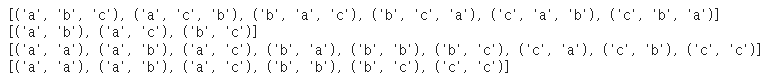
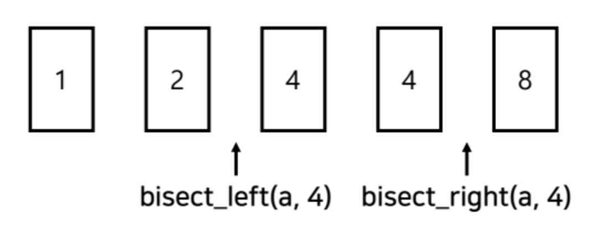
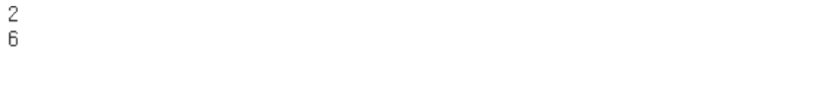

# 라이브러리 사용하기

### 📔내장 함수: import 없이 바로 사용할 수 있는 함수

```python
sum([1,2,3])
min(1,2,3)
max(1,4,5)

eval("1+1")

result = sorted([3,4,6,7,89])
result2 = sorted([2,34,5,7,8], reverse = True)
result3 = sorted(['김', 23]. ['거', 34], ['김', 36], key = lambda x:x[1])
```

- sum은 interable 객체(리스트, 사전 자료형, 튜플 자료형 등 반복 가능한 객체)
- min, max는 각각 가장 작은 값을 반환한다
- eval 함수는 수식이 문자열 형식으로 들어온다면, 해당 수식을 계산하여 결과를 반환한다
- sorted 함수는 iterable 객체가 들어온 경우에, 정렬하여 결과를 반영하는데, 기본은 오름차순 이지만, reverse=true라고 해놓으면 내림차순으로 변경하여 보여준다
- 특정 원소를 기준으로 정렬하고 싶은 경우 lambda를 이용한다. 정렬 기준으로 삼을 원소의 index를 넣어주면 해당 index를 가지는 원소를 기준으로 정렬하게 된다

### 📔Itertools: 반복되는 데이터를 처리하기 위한 기능 제공한다

```python
from itertools import *

data = ['a', 'b', 'c']
result = list(permutations(data, 3))
result2 = list(combinations(data, 2))

result3 = list(product(data, repeat=2))
result4 = list(combinations_with_replacement(data, 2))

```



- permutation은 r개의 데이터를 뽑아 일렬로 나열하는 모든 경우의 수를 계산한다. 객체 초기화 이후에는 list 형식으로 이용한다
- combination은 r개의 데이터를 봅아 순서를 고려하지 않고 나열하는 모든 경우의 수를 계산한다. 마찬가지로 list 형식으로 이용한다
- product는 r개의 데이터를 뽑아 일렬로 나열하는 모든 경우의 수를 계산한다. 단, 원소를 중복하여 뽑는다
- combinations_with_replacement는 r개의 데이터를 뽑아 순서를 고려하지 않고 뽑는다

### 📔Heapq: 우선순위 큐 구현을 위해 이용한다. 파이썬은 최소힙으로 구성되고, 최대힙 기능은 제공하지 않는다

```python
import heapq

def heapsort(iterable):
	h = []
	result = []
	
	for value in iterable:
		heapq.heappush(h, value)
	
	for _ in range(len(h)): 
		result.append(heapq.heappop(h))
	
	return result
```

- heappush를 이용하여 원소들을 차례대로 넣어준다
- 이후에 heap에 삽입된 모든 원소를 heappop을 통해 꺼내준다. 이 경우에는 최소 heap이기 때문에 오름차순으로 정렬된다
- 내림차순으로 하고 싶다면 value의 부호를 바꿔주면 된다
- 정렬에는 O(nlogn)이 소요된다

```python
#정렬된 순서에서 배열에 삽입할 a에 x를 삽입할 경우, 삽입하는 원소의 왼쪽 인덱스 반환
bisect_left(a, x)

#정렬된 순서에서 배열에 삽입할 a에 x를 삽입할 경우, 삽입하는 원소의 오른쪽 인덱스 반환
bisect_right(a, x)
```



```python
from bisect import bisect_left, bisect_right

def count_by_range(a, left_value, right_value): 
	right_index = bisect_right(a, right_value)
	left_index = bisect_left(a, left_value)
	return right_index - left_index

a = [1, 2, 3, 3, 3, 3, 4, 4, 8, 9]
print(count_by_range(a, 4, 4))
print(count_by_range(a, -1, 3))
```



- 첫번째 호출 함수의 경우에는 right는 4-8사이에 삽입되기 때문에 8, left는 3-4사이에 삽입되기 때문에 6으로 return되어 두 수 사이의 개수는 2가 된다
- 두번째 호출 함수의 경우에는 left는 1 앞에 삽입되기 때문에 0, right는 3-4사이에 삽입되기 때문에 6이되어 두 사이의 수는 6개가 된다

### 📔Collections: deque와 counter를 주로 사용한다

### Deque: 리스트 자료형과는 다르게, 인덱싱, 슬라이싱 기능은 사용할 수 없지만, 시작이나 끝 부분에 데이터를 삽입하는 경우에 유용하다

- 리스트는 append나 pop으로 원소를 추가하거나 삭제할때, 가장 뒤쪽 원소를 기준으로 하기 때문에 앞쪽에 삽입이나 삭제를 수행하는 경우 시간이 많이 소요된다
- popleft(): 첫번째 원소를 제거하는 경우에 사용한다
- pop():  마지막 원소를 제거하는 경우에 사용한다
- appendleft(x): 첫번째 index에 x를 삽입한다
- append(x): 마지막 index에 x를 삽입한다
- 원소 삽입시 append, 원소 제거시 popleft를 사용하면 먼저 들어온 원소가 먼저 나가게 된다

```python
from collection import deque

data = deque([2,3,4])
data.appendleft(1)
data.append(5)

list(data)
```

- 첫 index에 1을 삽입하고, 마지막 index에 삽입하면, 결과로 1,2,3,4,5가 나온다
- deque를 형변환 시켜서 리스트로 이용할 수 있다

### Counter: 특정 원소의 개수를 찾을 수 있다

```python
from collections import Counter

counter = Counter(['red', 'black', 'white'])

print(counter['blue'])
```

- 리스트와 같은 iterable 객체가 등장한 경우에, 특정한 원소의 등장 횟수를 count 하는 기능을 제공한다

### 📔Math: 수학 연산을 수행하는 기능을 제공한다

```python
import math

print(math.factorial(4))
print(math.sqrt(4))
print(math.gcd(12,10))

print(math.pi)
print(math.e)
```

- factorial, 제곱근, 최대 공약수를 계산해주는 함수를 이용할 수 있다
- pi, e등 숫자 값을 가져와서 이용할 수 있다