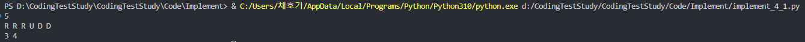

# Ch02. 구현

### 🧐구현: 머릿속의 알고리즘을 소스코드로 바꾸는 과정. 구현 문제는 풀이를 떠올리는 것은 쉽지만 소스코드로 옮기기 어려운 문제를 의미한다

- 보통 알고리즘 구현은 간단한데, 사소한 조건 설정이 많아 코드로 구현하기 힘든 문제다
- 완전탐색: 모든 경우의수를 주저없이 다 계산하는 문제
- 시뮬레이션: 문제에서 제시한 알고리즘을 한 단계씩 차례로 직접 수행한다

### 구현에 고려해야할 제약

- C/C++에서의 변수 표현 범위: int 자료형의 표현 범위는 대략 -2,000,000,000 ~ 2,000,000,000로 만약 더 큰수가 오면 long long 자료형을 이용하면, 9,000,000,000,000,000,000까지 표현 가능
    - 더 큰 수가 오면 BigInteger를 사용해야하는데, 자바 표준 라이브러리는 지원하지만 C++에서는 표준 라이브러리에서 지원하지 않는다
    - 그런데 보통 BigInteger까지 써야하는 문제는 출제되지 않는다
    - Python은 자료형이 자동으로 지정되기 때문에 자릿수까지 고려할 필요는 없다
- 파이썬에서 리스트 크기
    
    
    | 데이터 개수 | 메모리 사용량 |
    | --- | --- |
    | 1000 | 약 4KB |
    | 1000000 | 약 4MB |
    | 10000000 | 약 40MB |
    - 보통 코테에서는 128 ~ 512MB로 메모리를 제한한다
    - 파이썬에서는 다른 언어에 비해 고려사항이 적은 편이지만, 크기가 1000만 이상인 리스트에 대해서는 메모리 용량 제한으로 문제를 풀 수 없을수도 있다
    - 대회가 아닌 이상 일반적인 경우에는 사용량 제한보다 더 적은 크기의 메모리를 사용해야된다는 점만 기억해두면 된다. 실제 코딩테스트에서 그정도로 큰 리스트가 나올 일이 낮다
- 채점 환경: 보통 python은 C++에 비해 실행 속도가 느리다. 그래서 Python의 경우 시간을 더 주는 경우도 있는데, 일반적으로 제한 시간이 1초라면 O(NlogN)정도 이내에 알고리즘을 풀어야 시간 제한에 걸리지 않는다
- 구현 문제에 대한 접근
    
    
    |  | 구현 난이도 | 실행시간 |
    | --- | --- | --- |
    | 파이썬 | 쉬운 편 | 긴 편 |
    | PyPy | 쉬운 편 | 다소 짧은편 |
    | C/C++ | 어려운 편 | 짧은 편 |
    - 파이썬은 문자열에 있어서도 그렇고 기본적인 실력으로도 C, Java등에서 어려워하는 문제에 대한 고려할 필요가 없다
    - Python의 단점은 느리다는 것인데, Python3의 문법을 그대로 지원하는 PyPy가 최근 지원을 하는 경우가 많은데, PyPy는 C++에 근접한 속도로 실행되기 때문에, 만약 테스트에서 해당 언어를 지원하면 언어를 PyPy로 선택하는 것이 유리하다

### 예제1) 상하좌우: 정사각형 공간에서 여행자는 최종적으로 어느 좌표로 도달할까?

- 여행자가 N*N크기의 정사각형 공간에 서 있다
- 여행자의 시작점 좌표는 (1,1)이다
- 이동 경로 계획을 작성하는데 문자 L, R, U, D를 입력할 수 있다. 각각 왼쪽으로 한 칸 이동, 오른쪽으로 한 칸 이동, 위로 한칸 이동, 아래로 한 칸 이동이다
- N * N 정사각형 공간을 벗어나는 경로는 이동하지 않고 무시된다
- N과 이동 경로를 입력했을때, 여행자가 최종적으로  도착하는 좌푯값을 출력한다

<aside>
💻 첫째줄에 공간의 크기를 나타내는 N이 주어진다(1≤N≤100)
둘째줄에 여행가 A가 이동할 계획서 내용이 주어진다(1≤이동 횟수≤100)

</aside>

My solution

```python
n = int(input());
route = input().split()

x, y= 1, 1

for val in route:
    if val == 'L' and y > 1:
        y -= 1
    elif val == 'R' and y < n:
        y += 1
    elif val == 'U' and x > 1:
        x -= 1
    elif val == 'D' and x < n:
        x += 1
    else:
        continue

print(x, y)
```



- 비교 연산자를 이용하여 범위를 벗어나지 않는 경우에만 이동하도록 한다

Book’s solution

```python
# N 입력받기
n = int(input())
x, y = 1, 1
plans = input().split()

# L, R, U, D에 따른 이동 방향
dx = [0, 0, -1, 1]
dy = [-1, 1, 0, 0]
move_types = ['L', 'R', 'U', 'D']

# 이동 계획을 하나씩 확인
for plan in plans:
    # 이동 후 좌표 구하기
    for i in range(len(move_types)):
        if plan == move_types[i]:
            nx = x + dx[i]
            ny = y + dy[i]
    # 공간을 벗어나는 경우 무시
    if nx < 1 or ny < 1 or nx > n or ny > n:
        continue
    # 이동 수행
    x, y = nx, ny

print(x, y)
```

- 연산 횟수는 이동 횟수에 비례한다. 시간 복잡도는 O(N)이기 때문에 시간은 넉넉하다

### 예제2)시각: 시각에 N이 포함된 시간을 구하자

- 정수 N이 입력되면 00시 00분 00초부터 N시 59분 59초까지 시각 중에서 N이 하나라도 포함되는 경우의 수를 구한다

<aside>
💻 첫째줄에 정수 N이 입력된다

</aside>

Book’s solution

```python
h  = int(input())
count = 0

for i in range(h+1):
    for j in range(60):
        for k in range(60):
            if '3' in str(i) + str(j) + str(k):
                count +=1

print(count)
```


- 모든 경우의 수가 86400개밖에 존재하지 않기 때문에 파이썬에서 문자열 연산으로 모든 경우의 수를 확인하더라도 제한시간 안에 푸는 것이 가능하다
- 전체 시, 분, 초에 대해서 각각 loop를 돌려서 확인한다. 경우의 수는 24 * 60 * 60으로, 3중 for문을 이용하여 계산한다
- 완전 탐색(brute force): 이렇게 가능한 모든 경우에 대해 모든 경우의 수를 확인하는 것을 완전 탐색이라고 부른다. **탐색해야할 전체 데이터 개수가 100만개 이하인 경우에만 적합하다**
- 00시 00분 00초부터 N시 59분 59초까지 각 시 분 초를 쪼개서 하나의 문자열로 만들어 00시 00분 00초의 경우 000000으로 하여, N이 있는지 없는지 여부를 판단하고, 있다면 count개수를 1 늘려주면 된다

### 예제3)왕실의 나이트: 나이트가 이동할 수 있는 경우의 수는?

- 체스판 8 * 8에서 나이트는 특정 한 칸에 위치한다
- 나이트가 이동할 수 있는 경로는 두가지다
    1. 수평으로 두 칸 이동한 뒤에 수직으로 한 칸 이동하기
    2. 수직으로 두 칸 이동한 뒤에 수평으로 한 칸 이동하기
- 8 * 8 좌표 평면상에 나이트의 위치가 주어질때, 나이트가 이동할 수 있는 경우의 수를 표현하라
- 체스판의 가로는 a, b, c…알파벳 순서로, 세로는 1, 2, 3… 숫자 순서로 나타낸다

<aside>
💻 첫째줄에 8 * 8 좌표 평면상에서 현재 나이트가 위치한 곳의 좌표를 나타내는 두 문자로 구성된 문자열이 입력된다. 입력 문자는 a1처럼 열과 행으로 이루어진다

</aside>

My solution

```python
coord = input()

xcoord = ['a', 'b', 'c', 'd', 'e', 'f', 'g', 'h']
possible_x=[-2, -1, 1, 2, -2, -1, 1, 2]
possible_y=[-1, -2, -2, -1, 1, 2, 2, 1]

x = xcoord.index(coord[0])
y = int(coord[1])-1
count = 0

for i in range(8):
    new_x_coord = x + possible_x[i]
    new_y_coord = y + possible_y[i]

    if new_x_coord >= 0 and new_x_coord < 8 and new_y_coord >= 0 and new_y_coord < 8:
        count += 1

print(count)
```


- 움직일 수 있는 경우의 수는 8개뿐이다. 이를 각 x, y 좌표를 얼만큼 이동시켜야 할지 배열로 저장해두고 입력한 좌표를 int형식 좌표로 변환하고, 이동가능한 좌푯값을 하나씩 더해주면서, 범위를 벗어나는지 벗어나지 않는지 확인한다
- 벗어나면 count값을 늘려주지 않고, 벗어나면 count를 1씩 증가시켜준다

Book’s solution

```python
# 현재 나이트의 위치 입력받기
input_data = input()
row = int(input_data[1])
column = int(ord(input_data[0])) - int(ord('a')) + 1

# 나이트가 이동할 수 있는 8가지 방향 정의
steps = [(-2, -1), (-1, -2), (1, -2), (2, -1), (2, 1), (1, 2), (-1, 2), (-2, 1)]

# 8가지 방향에 대하여 각 위치로 이동이 가능한지 확인
result = 0
for step in steps:
    # 이동하고자 하는 위치 확인
    next_row = row + step[0]
    next_column = column + step[1]
    # 해당 위치로 이동이 가능하다면 카운트 증가
    if next_row >= 1 and next_row <= 8 and next_column >= 1 and next_column <= 8:
        result += 1

print(result)
```

- 이동 가능한 좌표를 현재 좌표를 기준으로 [(-2, -1), (-1, -2), (1, -2), (2, -1), (2, 1), (1, 2), (-1, 2), (-2, 1)]가 가능한데, 이를 배열에 넣어준다
- 현재 위치에서 가능한 좌표를 더해주고 8 * 8 사각형 안에 있는지 확인한다
- 까다로운 테스트인 경우에는 a1이 아니라 1a같이 입력했을때 handling해야할 수 있다
- 이런식으로 가능한 경우를 배열에 저장해두고 비교하는 연산을 해야하는 경우가 많이 나온다